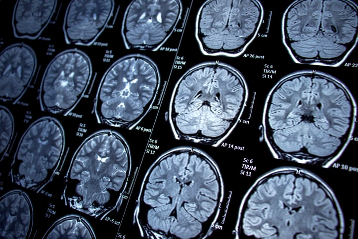
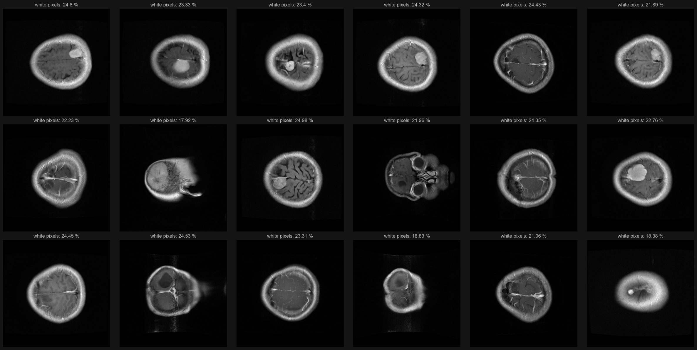
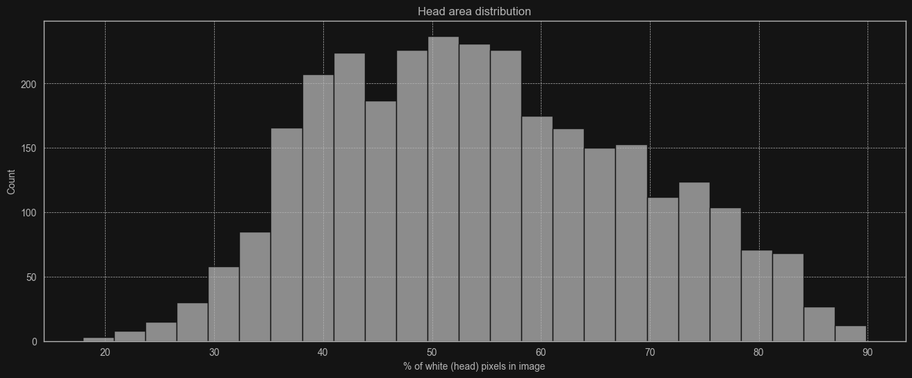
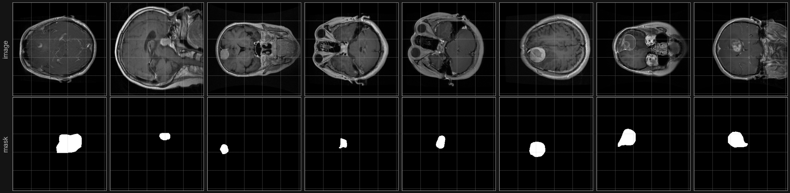
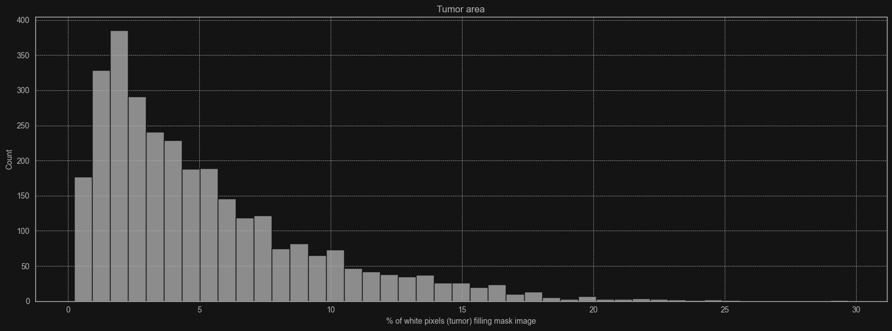

    

<h1>Predicting tumor type and it's location</h1>
<h3>
    In this project I analyzed 'Brain tumor dataset', a T1 weighted image dataset from figshare.
    The project is in notebook format (.ipynb) that shows the process of data analysis and building models.
</h3>

<h2>In this project you will find:</h2>
<ul>
    <li>Image data analysis</li>
    <li>Preprocessing image data</li>
    <li>Creating neural network models with TensorFlow and Keras</li>
</ul>

<h2>What I achieved:</h2>
<ul>
    <li>AI model that predicts tumor type with accuracy of roughly 95%</li>
    <li>AI model that predicts tumor location based on predicted binary mask</li>
</ul>

<h1>Example features I extracted from data</h1>
<h2>Head size</h2>

    I calculated amount of white pixels inside image.
    In summary this plot returns images where head fills specified % of area in image.

<h2>Tumor size</h2>

    Similarly to head size I also calculated amount of white pixels inside, 
    but this time I used tumor border coordinates to create binary mask and then counted the white pixels in it.

